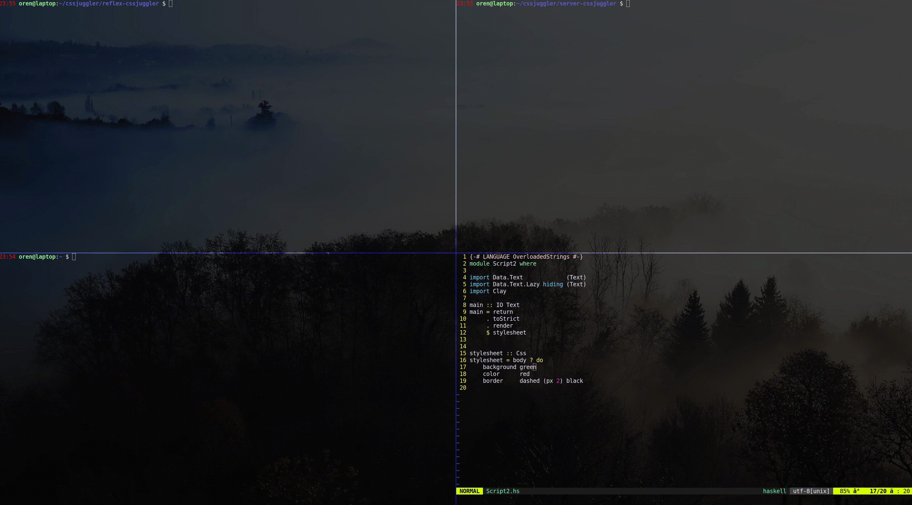

# CSS Juggler

This tool is used to juggle between CSS styles on real time.
It is written in Haskell and uses Nix and some Haskell libraries (such as Reflex) that are brought as Nix packages from NixOS.

You can check the first lines of the `server-cssjuggler/Juggler.hs `:
```
#! /usr/bin/env nix-shell
#! nix-shell -I nixpkgs=https://github.com/NixOS/nixpkgs/archive/18.03.tar.gz -i runhaskell -p "pkgs.haskell.packages.ghc802.ghcWithPackages (pkgs: with pkgs; [ aeson twitch hint clay websockets])"
```

### Exanple of loading the juggler

```
$ cd reflex-cssjuggler
$ ./Frontend.hs
$ cd Frontend.jsexe 
$ python -m SimpleHTTPServer 8080 & 
```
And then you can get to http://localhost:8080/ in your brouser (I checked it on chrome and it worked) and Juggle between style sheets pressing the "Next" button.

You can edit and add style sheets on the tile `server-cssjuggler/Script.hs`

This script uses CLay library. For more information: [Haskell Clay](http://hackage.haskell.org/package/clay-0.13.1/docs/Clay.html)

### Example of Running gif:

CSSJuggler
===

# Haskell-CSS-Juggler
